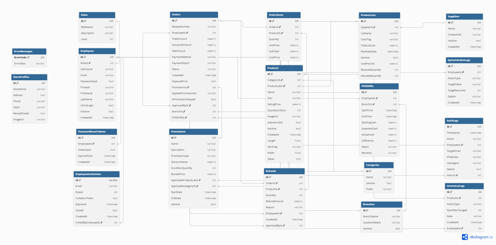

# ThriftFlow ระบบขายเเละจัดการร้านค้าเสื้อผ้ามือสอง — Backend

> **Language:** [English](README-en.md) | [ภาษาไทย](README.md)

ระบบ Backend สำหรับ ThriftFlow ระบบจัดการร้านค้าเสื้อผ้ามือสอง (POS + Inventory Management + Sale Analytics) ด้วย ASP.NET Core (C#) , PostgreSQL(RDB), Supabase Storage(Blob) เป็นโปรเจกต์จบการศึกษาพัฒนาขึ้นเพื่อเเก้ปัญหาการจัดการร้านค้าเสื้อผ้ามือสองซึ่งมักมีสินค้าจำนวนมากที่ไม่ซ้ำกันในเเต่ละชิ้น และต้องการให้มีความสะดวกและมีประสิทธิภาพมากขึ้นในการจัดการ โดยจะเชื่อมต่อกับระบบจัดการร้านค้าเสื้อผ้ามือสอง (Frontend)

**Frontend repository:** [ThriftFlow-Frontend](https://github.com/phantoyooburee/Frontend_ThirftFlow.git)

**Live Demo:** [https://thriftflow.vercel.app](https://thriftflow.vercel.app)


---
## สารบัญ Table of Contents

- [เกี่ยวกับโปรเจกต์](#เกี่ยวกับโปรเจกต์)
- [คุณสมบัติเด่น](#คุณสมบัติเด่น)
- [สถาปัตยกรรมระบบ](#สถาปัตยกรรมระบบ)
- [เทคโนโลยีที่ใช้](#เทคโนโลยีที่ใช้)
- [ความต้องการของระบบ](#ความต้องการของระบบ)
- [การติดตั้งและตั้งค่า](#การติดตั้งและตั้งค่า)
- [วิธีใช้งาน](#วิธีใช้งาน)
- [API Documentation](#api-documentation)
- [โครงสร้างฐานข้อมูล](#โครงสร้างฐานข้อมูล)
- [Architecture Decisions](#architecture-decisions)
- [ความปลอดภัย](#ความปลอดภัย)
- [การทดสอบ](#การทดสอบ)
- [License](#license)
- [ผู้พัฒนา](#ผู้พัฒนา)

---

## เกี่ยวกับโปรเจกต์

ร้านเสื้อผ้ามือสองมักเจอปัญหาการจัดการสต็อกที่ยุ่งยากกว่าร้านค้าทั่วไป เพราะสินค้าแต่ละชิ้นมักไม่ซ้ำกัน (one-of-a-kind) จำนวนสินค้าเข้าออกเร็ว และการติดตามด้วยมือหรือสเปรดชีตทำให้เกิดความผิดพลาดและเสียเวลานอกจากนี้ในเเต่ละวันยังมีการขายสินค้าหลายสถานที่

**ThriftFlow Backend** คือ RESTful API ที่พัฒนาขึ้นเพื่อแก้ปัญหานี้ ครอบคลุมตั้งแต่การขายหน้าร้าน (POS) การจัดการสต็อกสินค้าแบบรายชิ้น/รายล็อต ระบบสมาชิก/สิทธิ์การใช้งาน ไปจนถึงระบบโปรโมชั่นอัตโนมัติ 
ออกแบบให้รองรับการขายจากหลายสาขา โดยใช้สต็อกสินค้ากลางร่วมกัน พร้อมแยกบันทึกยอดขายและติดตามได้ว่าสินค้าแต่ละชิ้นถูกขายออกจากสาขาใด

**ทำไมถึงเลือกใช้เทคโนโลยีนี้:**

- **ASP.NET Core**: ต้องการ type-safety และ performance ที่เหมาะกับระบบ POS ที่ต้องตอบสนองเร็ว
- **PostgreSQL**: ฐานข้อมูล Relational Database ที่มีความเสถียรสูง เหมาะกับระบบที่มี Transaction สต็อกและการเงินจำนวนมาก
- **Entity Framework Core (EF Core)**: ใช้เป็น ORM หลักเพื่อจัดการ CRUD Operations ช่วยให้ออกแบบฐานข้อมูลแบบ Code-First ได้อย่างรวดเร็ว
- **Supabase Storage**: ใช้เก็บรูปภาพสินค้าแทนการเก็บในฐานข้อมูล เพิ่มประสิทธิภาพและลดขนาดฐานข้อมูล
- **JWT + BCrypt**: เพื่อการจัดการ session และ password ที่ปลอดภัย
- **Swagger**: สำหรับ API Testing และเป็นเอกสารประกอบ API

ดูฝั่ง UI และการใช้งานจริงได้ที่ [Frontend repository](https://github.com/phantoyooburee/Frontend_ThirftFlow.git)

## คุณสมบัติเด่น

###  Point of Sale (POS)
- ขายสินค้าแบบเร็ว รองรับสแกน Barcode
- คำนวณราคา/ส่วนลด/โปรโมชั่นอัตโนมัติจากฝั่ง backend (ป้องกันการปลอมแปลงราคาจาก client)
- รองรับการขายจากหลายสาขา แยกบันทึกยอดขายตามสาขา

###  Inventory Management
- แยกประเภทสินค้า 3 มิติ: Category, ProductLot, IsGenericSKU
- แยกสินค้าแบบมี Barcode เฉพาะชิ้น (Tagged Items) กับสินค้าขายเป็นล็อต (Bulk Items)
- ปรับสต็อกพร้อม audit trail 

###  User & Access Management
- Role-based Access Control: Owner / Manager / Staff
- รองรับการจัดการหลายสาขา (Multi-Branch) ภายในร้านเดียว เพื่อแยกบันทึกยอดขายและการทำงานของแต่ละสาขา(ข้อมูลแต่ละร้านแยกจากกันในฐานข้อมูลเดียว)
- Authentication ครบวงจร: Register, Login, Forgot/Reset Password (JWT + BCrypt)

###  Promotion Engine
- ระบบค้นหาโปรโมชั่นที่เข้าเงื่อนไขอัตโนมัติ (auto-discovery)
- Tie-breaking ตามความจำเพาะของเงื่อนไข (specificity-based)
- ควบคุมสิทธิ์การ override ราคาตาม  role

###  การชำระเงิน
- รองรับช่องทางการชำระเงิน: เงินสด, โอนเงิน(โดยช่องทางชำระเเบบโอนเงินจะเป็นการเก็บสลิปใบเสร็จจากการถ่ายรูป)
- แยกบันทึกช่องทางการชำระเงินในใบเสร็จ
- รองรับการชำระเงินโดยเป็นราคาเหมาจ่ายหรือตามที่ตกลงกับร้าน

###  Sales Analytics
- สรุปยอดขายรายวัน/รายสัปดาห์/รายเดือน
- รายงานแยกตามสาขาและพนักงาน
- วิเคราะห์สินค้าขายดี/สินค้าขายช้า

## สถาปัตยกรรมระบบ
ระบบถูกออกแบบโดยใช้สถาปัตยกรรมแบบ **N-Tier Architecture (Layered)** ผ่าน RESTful API เพื่อให้ง่ายต่อการดูแลรักษาและการเพิ่มฟีเจอร์ในอนาคต:

```text
[ Client / Web Browser ]  (Frontend: React/Vite)
          │
          ▼  (HTTP / REST API)
          │
[ Backend API Server ]    (ASP.NET Core 8)
          │
          ├───────────────┐
          ▼               ▼
[ PostgreSQL Database ] [ Supabase Storage ]
 (เก็บข้อมูลระบบทั้งหมด)      (เก็บรูปภาพสินค้า/สลิปโอนเงิน)
```

## เทคโนโลยีที่ใช้
- **Runtime/Framework**: C# / ASP.NET Core
- **Database**: PostgreSQL
- **Data Access**: Entity Framework Core
- **Authentication**: JWT Bearer, BCrypt
- **File Storage**: Supabase Storage
- **API Documentation**: Swagger / OpenAPI
- **Email**: Gmail SMTP (สำหรับ Invite Employee, Forgot Password)

---

## ความต้องการของระบบ
- [.NET 9.0 SDK](https://dotnet.microsoft.com/download/dotnet/9.0)
- PostgreSQL (ใด ก็ได้ที่ Npgsql รองรับ)
- Supabase account (สำหรับ File Storage)
- Gmail App Password (สำหรับฟีเจอร์ Invite Employee และ Forgot Password)
- Docker (ถ้าต้องการรันผ่าน Container)

---

## การติดตั้งและตั้งค่า

### 1. clone repository

```bash
git clone https://github.com/phantoyooburee/Backend_ThriftFlowSystem.git

cd Backend_ThriftFlowSystem
```
### 2. ตั้งค่า Environment Variables
โครงสร้างค่าที่ต้องตั้งมีดังนี้ (`appsetting.example.json`):

```json
{
  "Jwt": {
    "Key": "YOUR_KEY",
    "Issuer": "YOUR_ISSUER",
    "Audience": "YOUR_AUDIENCE",
    "ExpiresMinutes": 480
  },
  "Email": {
    "Port": 587,
    "Password": "YOUR_EMAIL_PASSWORD",
    "Host": "smtp.gmail.com",
    "From": "YOUR_EMAIL"
  },
  "ConnectionStrings": {
    "DBContext": "Host=localhost;Port=5432;Database=ThriftFlowDb;Username=postgres;Password=YOUR_PASSWORD;"
  },
  "Supabase": {
    "Url": "YOUR_SUPABASE_URL",
    "Key": "YOUR_SUPABASE_KEY"
  },
  "App": {
    "BaseUrl": "http://localhost:5173"
  }
}
```

ค่าที่เป็นความลับ (`Jwt:Key`, `Email:Password`, `ConnectionStrings:DBContext`, `Supabase:Url`, `Supabase:Key`) แนะนำให้ตั้งผ่าน [.NET User Secrets](https://learn.microsoft.com/en-us/aspnet/core/security/app-secrets) แทนการเขียนลงไฟล์โดยตรง:
```bash
dotnet user-secrets init
dotnet user-secrets set "Jwt:Key" "your_secret_key"
dotnet user-secrets set "Email:Password" "your_gmail_app_password"
dotnet user-secrets set "ConnectionStrings:DBContext" "Host=localhost;Port=5432;Database=ThriftFlowDb;Username=postgres;Password=your_password;"
dotnet user-secrets set "Supabase:Url" "your_supabase_url"
dotnet user-secrets set "Supabase:Key" "your_supabase_key"
```
> วิธีนี้เก็บค่าลับไว้นอก repo โดยอัตโนมัติ (User Secrets ไม่ถูก commit ขึ้น Git อยู่แล้วตามกลไกของ .NET) จึงไม่มีความเสี่ยงที่รหัสผ่านจะหลุดไปกับโค้ด

### 3. Restore Dependencies
```bash
dotnet restore
```

### 4. รัน Migration
```bash
dotnet ef database update
```

### 5. รันเซิร์ฟเวอร์
```bash
dotnet run
```
---

## วิธีใช้งาน
สามารถเข้าใช้งาน API ได้ที่ `http://localhost:[YourPort]` และทดสอบ Endpoint ต่างๆ ผ่าน Swagger ที่ `http://localhost:[YourPort]/swagger/`

### การเริ่มต้นใช้งาน (ครั้งแรก)
**1. ตรวจสอบสถานะระบบ (ว่ามีผู้ใช้งานแล้วหรือยัง)**
```http
GET /api/auth/system-status
```
> ถ้า response "isInitialized": false แสดงว่ายังไม่มีผู้ใช้งาน

**2. สมัครบัญชี Owner (ทำได้เฉพาะครั้งแรกที่ยังไม่มีพนักงานในระบบ)**
```http
POST /api/auth/register
Content-Type: application/json
{
  "email": "user@example.com",
  "username": "your_username",
  "password": "your_password",
  "pin": "your_pin",
  "firstName": "your_first_name",
  "lastName": "your_last_name"
}
```

**3. Login เพื่อรับ JWT Token**
```http
POST /api/auth/login
Content-Type: application/json

{
  "username": "owner@example.com",
  "password": "your_password"
}
```
> โดยที่ `username` สามารถใช้ Email หรือ Username ก็ได้

### การเพิ่มพนักงานคนอื่นๆ (Owner/Manager เท่านั้น)
**4. เชิญพนักงานผ่าน Email (ต้องแนบ JWT Token)**
```http
POST /api/auth/invite
Authorization: Bearer {your_jwt_token}
Content-Type: application/json

{
   "email": "[EMAIL_ADDRESS]",
   "roleId": 1
}
```
> `roleId` 1 = Owner, 2 = Manager, 3 = Staff
>>ระบบจะส่ง Invitation Token ไปที่ Email ของพนักงาน

**5. พนักงานสมัครด้วย Invitation Token จาก Email**

```http
POST /api/auth/register
Content-Type: application/json
{
  "invitationToken": "string",
  "email": "user@example.com",
  "username": "your_username",
  "password": "your_password",
  "pin": "your_pin",
  "firstName": "your_first_name",
  "lastName": "your_last_name"
}
```
>หลังจาก Register เเล้ว สามารถไป 
>> POST /api/auth/login ใช้ Token เรียก API อื่นๆ


**6. ใช้ Token เรียก API อื่นๆ**
```http
GET /api/products
Authorization: Bearer {your_jwt_token}
```

### การจัดการคำสั่งซื้อและชำระเงิน (POS)

**7.1 เปิด Shift (เปิดกะการทำงาน)**
```http
POST /api/pos/shift/open
Authorization: Bearer {your_jwt_token}
Content-Type: application/json
{
  "branchId": 1,
  "startingCash": 500
}
```
>ต้องทำทุกเช้าก่อนเริ่มขาย — startingCash คือเงินสดตั้งต้นในลิ้นชักก่อนเริ่มกะ
ถ้ายังไม่ open shift แล้วพยายาม checkout ระบบจะ error ทันที

**7.2 ปิด Shift (ปิดกะ/กระทบยอด)**
```http
POST /api/pos/shift/close
Authorization: Bearer {your_jwt_token}
Content-Type: application/json
{
  "branchId": 1,
  "endingCash": 500
}
```
>ต้องทำทุกเย็นหลังปิดร้าน — endingCash คือเงินสดจริงในลิ้นชักหลังปิดกะ
ระบบจะคำนวณส่วนต่าง (ขาด/เกิน) และบันทึกยอดขายทั้งหมดในกะนั้น

**8. คำนวณตะกร้าสินค้าก่อน Checkout (ตรวจสอบราคาและโปรโมชั่น)**
```http
POST /api/pos/calculate-cart
Authorization: Bearer {your_jwt_token}
Content-Type: application/json
{
  "items": [
    { "productId": 1, "quantity": 2 },
    { "productId": 5, "quantity": 1 }
  ],
  "skipPromotion": false,
  "specialPrice": null
}
```
**9. Checkout (ชำระเงินและบันทึกการขาย)**
```http
POST /api/pos/checkout
Authorization: Bearer {your_jwt_token}
Content-Type: multipart/form-data

paymentMethod: CASH
cashReceived: 500
branchId: 1
orderItemsJson: [{"productId":1,"quantity":2},{"productId":5,"quantity":1}]
slipImage: (แนบไฟล์รูปสลิป — เฉพาะกรณีโอนเงิน)
```
>paymentMethod รับค่า CASH หรือ TRANSFER
ถ้าเป็น TRANSFER ต้องแนบ slipImage (ไฟล์รูปถ่าย) มาด้วย
ถ้าต้องการใช้ราคาพิเศษ (ตกลงกับลูกค้า) ให้ส่ง specialPrice และ managerPin มาพร้อมกัน

**10. ค้นหา Order ตามเลขใบเสร็จ**
```http
GET /api/pos/orders/search?receiptNumber=TF-20260806-001
Authorization: Bearer {your_jwt_token}
```
>ใช้สำหรับดึงรายละเอียด Order เพื่อทำ Refund หรือตรวจสอบประวัติการขาย

### การจัดการสินค้า (Inventory)
**11. เพิ่ม Supplier (ซัพพลายเออร์/เจ้าของล็อต) — เฉพาะ Owner**
```http
POST /api/inventory/suppliers
Authorization: Bearer {your_jwt_token}
Content-Type: application/json
{
  "name": "แม่ค้าตลาดนัดจตุจักร",
  "contactInfo": "086-xxx-xxxx"
}
```
**12. สร้างล็อตสินค้า (ProductLot) — ทำก่อนเพิ่มสินค้าทุกครั้ง (เฉพาะ Owner)**
```http
POST /api/inventory/product-lots
Authorization: Bearer {your_jwt_token}
Content-Type: application/json
{
  "lotName": "Lot มิถุนายน 2026",
  "supplierId": 1,
  "colorTag": "ป้ายเขียว",
  "totalLotCost": 3000,
  "receivedQuantity": 50
}
```

**13. เพิ่มสินค้าใหม่ (เข้าล็อตเดิมหรือล็อตใหม่)**
```http
POST /api/inventory/products
Authorization: Bearer {your_jwt_token}
Content-Type: multipart/form-data
{
categoryId: 1
productLotId: 1
name: "เสื้อยืด Vintage สีขาว"
sellingPrice: 250
initialQuantity: 1
isGenericSKU: false
neckTag: " M "
width: 52
length: 70
detail: " สภาพดี ไม่มีรอยขาด " 
imageFile: (แนบไฟล์รูปสินค้า)
}
```
>isGenericSKU: false = สินค้ามีรหัสบาร์โค้ดไม่ซ้ำกันเป็นสินค้าสินเดียวที่เป็น (หัวผ้า)
>> isGenericSKU: true = สินค้าขายเป็นล็อตหรือสินค้าที่ต้องการขายเหมา(หางผ้า)

**14.ปรับสต็อกสินค้า (Adjust Stock) — เฉพาะ Owner/Manager**
```http
POST /api/inventory/adjust-stock
Authorization: Bearer {your_jwt_token}
X-PIN: {manager_pin}
Content-Type: application/json

{
  "productId": 1,
  "quantity": -1,
  "actionType": "DAMAGED",
  "note": "สินค้าชำรุด ตัดออกจากสต็อก"
}
```
## API Documentation

หลังรันเซิร์ฟเวอร์แล้ว เข้าดู Swagger UI ได้ที่:
```
https://localhost:[YourPort]/swagger
```
### Endpoint หลักๆ (Core Endpoints)
- **Authentication**:
  - `POST /api/auth/register` (สมัครสมาชิกร้านครั้งแรก หรือ สมัครผ่าน Invite)
  - `POST /api/auth/login` (ล็อกอินรับ Token)
  - `POST /api/auth/invite` (Owner สร้างลิงก์เชิญพนักงาน)
- **Inventory (สินค้าคงคลัง)**:
  - `POST /api/inventory/product-lots` (สร้างล็อตสินค้าเข้า)
  - `POST /api/inventory/products` (เพิ่มสินค้าใหม่เข้าคลัง พร้อมรูป)
  - `POST /api/inventory/adjust-stock` (ปรับลด/เพิ่มสต็อก เช่น ชำรุด, สูญหาย)
- **POS (จุดขาย)**:
  - `POST /api/pos/shift/open` (เปิดกะประจำวัน)
  - `POST /api/pos/calculate-cart` (คำนวณราคาสุทธิก่อนชำระ)
  - `POST /api/pos/checkout` (ชำระเงิน ตัดสต็อก บันทึกยอด)
  - `POST /api/pos/shift/close` (ปิดกะ กระทบยอดเงิน)
---

## โครงสร้างฐานข้อมูล
ระบบใช้ Entity Framework Core (Code-First) ในการออกแบบฐานข้อมูล โดยมีตารางหลักดังนี้:


- **`Employees` & `Roles`**: จัดการพนักงานและสิทธิ์ (Owner, Manager, Staff)
- **`Products` & `ProductLots`**: จัดการสินค้าทั้งแบบชิ้นเดียว (Unique) และแบบกลุ่ม (Bulk) พร้อมติดตามต้นทุนจากล็อต
- **`Orders` & `OrderItems`**: บันทึกประวัติการขาย ใบเสร็จ และรายละเอียดสินค้าที่ถูกขาย
- **`POSShifts`**: จัดการการเปิด/ปิดกะ และตรวจสอบยอดเงินในลิ้นชักของแต่ละสาขา
- **`InventoryLogs`**: บันทึกการเข้า-ออกของสต็อกทุกครั้งเพื่อทำ Audit Trail
---
## Architecture Decisions

ส่วนนี้อธิบายการตัดสินใจทางเทคนิคที่สำคัญ — เหมาะสำหรับผู้สัมภาษณ์ที่อยากเข้าใจการออกแบบระบบ:

- **N-Tier (Layered) Architecture**: ออกแบบระบบโดยแยกส่วนประกอบเป็น `Controllers`, `Services`, `DTOs` และ `Data` (Repository) อย่างชัดเจน ช่วยลดความซับซ้อน (Fat Controller) และทำให้ง่ายต่อการเขียน Unit Test และการขยายสเกลในอนาคต
- **Multi-Branch Design**: เลือกระบบจัดการแบบร้านเดียวแต่หลายสาขา (Single Store, Multiple Branches) โดยผูก `BranchId` เข้ากับ `POSShift` ทำให้แต่ละสาขาสามารถเปิด/ปิดกะ และกระทบยอดขายของตัวเองได้อย่างอิสระโดยข้อมูลไม่ตีกัน
- **Hybrid Product Tracking (IsGenericSKU)**: เนื่องจากร้านเสื้อผ้ามือสองมีทั้งสินค้าแบบ "หัวผ้า" (มีชิ้นเดียวในโลก) และ "หางผ้า" (ขายเหมา/มีหลายชิ้น) จึงออกแบบฟิลด์ `IsGenericSKU` (boolean) เพื่อบังคับว่าถ้าเป็นสินค้าชิ้นเดียว (false) สต็อกจะห้ามเกิน 1 ชิ้นเสมอ ช่วยแก้ปัญหาการขายของซ้ำซ้อน
- **Promotion & Pricing Security**: ย้ายลอจิกการคำนวณราคาสุทธิ ส่วนลด และโปรโมชั่นทั้งหมดไปไว้ที่ `POSServices` ฝั่ง Backend (ผ่าน Endpoint `calculate-cart`) ป้องกันไม่ให้ Client (Frontend) ส่งราคาสุทธิที่ถูกปลอมแปลงมาบันทึกในฐานข้อมูล
- **Cost-Effective Payment Flow**: สำหรับร้านค้าขนาดเล็ก การเชื่อมต่อ Bank API (Payment Gateway) มีต้นทุนสูง จึงออกแบบระบบให้รองรับการอัปโหลดไฟล์รูปภาพสลิปโอนเงิน (`UploadSlipLater`) เพื่อเป็นหลักฐานในฐานข้อมูลแทน ช่วยประหยัดต้นทุนและลดความซับซ้อนของระบบ
---

## ความปลอดภัย
- **JWT Authentication** (Access Token) สำหรับยืนยันตัวตนในการเข้าถึง API 
- **Action PIN (X-PIN)** กำหนดให้ Manager/Owner ต้องกรอกรหัส PIN 6 หลักเมื่อทำรายการที่อ่อนไหว (เช่น ยกเลิกบิล, ปรับสต็อก, อัปเดตสินค้า) เพื่อป้องกันการทุจริต
- **Password Hashing** ป้องกันการหลุดรหัสผ่านด้วย `BCrypt`
- **Role-based Access Control (RBAC)** แบ่งระดับสิทธิ์การเข้าถึงข้อมูลอย่างชัดเจน (Owner, Manager, Staff)
- **Input Validation** ป้องกันข้อมูลผิดพลาดตั้งแต่ด่านหน้าด้วย Data Annotations ใน Model/DTO
---
## การทดสอบ

การทดสอบระบบในฝั่ง Backend ปัจจุบันสามารถทำได้ผ่าน Swagger UI:

1. รันโปรเจกต์ผ่าน Visual Studio หรือใช้คำสั่ง `dotnet run` ใน Terminal
2. เปิดเบราว์เซอร์ไปที่ `http://localhost:[YourPort]/swagger`
3. ใน Endpoint ที่ต้องการ ให้คลิก **"Try it out"**
4. สำหรับ API ที่ล็อกไว้ ให้ไป Login ก่อน เพื่อเอา Token มาใส่ในปุ่ม **"Authorize"** ด้านบน (พิมพ์ `Bearer {token}`)
5. ทดสอบยิง Request และดูผล Response ได้ทันที
**6. นำบัญชีทดลองด้านล่างนี้ ไป Login ผ่าน Endpoint `POST /api/auth/login` เพื่อรับ Token**

### Demo Access (บัญชีทดลองใช้งาน)
| Role | Username | Password | Manager PIN |
| :--- | :--- | :--- | :--- |
| **Owner** | `demo_owner` | `password123` | `123456` |
| **Manager** | `demo_manager` | `password123` | `654321` |
| **Staff** | `demo_staff` | `password123` | `121234` |

4. นำ Token ที่ได้มาใส่ในปุ่ม **"Authorize"** ด้านบน (พิมพ์คำว่า `Bearer ` ตามด้วย Token)
5. ใน Endpoint ที่ต้องการ ให้คลิก **"Try it out"** ทดสอบยิง Request และดูผล Response ได้ทันที
---

## License

โปรเจกต์นี้ใช้สัญญาอนุญาตแบบ **MIT License** 
คุณสามารถนำซอร์สโค้ดไปศึกษา ทดลองรัน ดัดแปลง หรือนำไปต่อยอดได้อย่างอิสระ (ดูรายละเอียดเพิ่มเติมได้ที่ไฟล์ [LICENSE](LICENSE))

---

## ผู้พัฒนา

**Phanto Yooburee**
- GitHub: [phantoyooburee](https://github.com/phantoyooburee)
- LinkedIn: [Phanto Yooburee](https://www.linkedin.com/in/yooburee-phanto)

---

*ดูฝั่ง Frontend ได้ที่ [ThriftFlow-Frontend](https://github.com/phantoyooburee/ThriftFlow-Frontend)*
